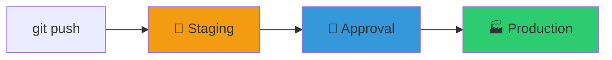
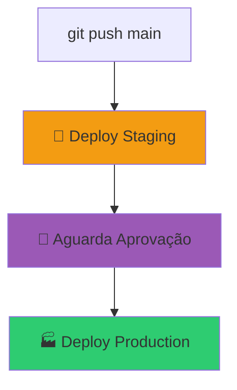

# 🎬 Vídeo 6.2 - Gerenciamento e Deploy de Ambientes Serverless

**Aula**: 6 - Serverless  
**Vídeo**: 6.2  
**Tema**: Estratégia de deploy de aplicações serverless. Hands-on: Gerenciando o deploy para ambientes distintos (staging, production) com variáveis de ambiente.

---

## 🎯 Objetivo

Criar **pipeline CI/CD multi-ambiente**: staging → production.



---

## 📁 Estrutura do Projeto (já existe)

```
fiap-dclt-aula06/
├── template.yaml          # SAM template (com Parameter Environment)
├── samconfig.toml         # Configurações multi-ambiente
├── src/
│   └── handlers.py
└── .github/workflows/
    ├── sam-pipeline.yml           # Pipeline simples (Vídeo 6.1)
    └── sam-pipeline-multi-env.yml # ← Vamos criar este
```

---

## ⚙️ Parte 1: Entender Configuração Multi-Ambiente

### Passo 1: Ver samconfig.toml

O arquivo já tem configurações para cada ambiente:

```toml
version = 0.1

[default]
[default.deploy.parameters]
stack_name = "fiap-serverless-dev"
parameter_overrides = "Environment=dev"

[staging]
[staging.deploy.parameters]
stack_name = "fiap-serverless-staging"
parameter_overrides = "Environment=staging"

[production]
[production.deploy.parameters]
stack_name = "fiap-serverless-prod"
parameter_overrides = "Environment=prod"
```

### Passo 2: Deploy manual por ambiente (opcional)

```bash
# Deploy staging
sam build
sam deploy --config-env staging

# Deploy production
sam deploy --config-env production
```

---

## 🚀 Parte 2: Pipeline Multi-Ambiente

### Passo 3: Criar workflow multi-ambiente

**Linux/Mac:**
```bash
cat > .github/workflows/sam-pipeline-multi-env.yml << 'EOF'
name: 🚀 SAM Multi-Environment Pipeline

on:
  push:
    branches: [main]
  workflow_dispatch:

env:
  AWS_REGION: us-east-1

jobs:
  # ========================================
  # JOB 1: Deploy Staging
  # ========================================
  deploy-staging:
    name: 🧪 Deploy Staging
    runs-on: ubuntu-latest
    environment: staging
    
    steps:
      - uses: actions/checkout@v4
      
      - uses: actions/setup-python@v5
        with:
          python-version: '3.9'
      
      - uses: aws-actions/setup-sam@v2
      
      - uses: aws-actions/configure-aws-credentials@v4
        with:
          aws-access-key-id: ${{ secrets.AWS_ACCESS_KEY_ID }}
          aws-secret-access-key: ${{ secrets.AWS_SECRET_ACCESS_KEY }}
          aws-session-token: ${{ secrets.AWS_SESSION_TOKEN }}
          aws-region: ${{ env.AWS_REGION }}
      
      - name: 🔨 SAM Build
        run: sam build
      
      - name: 🧪 Deploy Staging
        run: |
          sam deploy --config-env staging \
            --no-confirm-changeset \
            --no-fail-on-empty-changeset
      
      - name: 📋 URL Staging
        run: |
          aws cloudformation describe-stacks \
            --stack-name fiap-serverless-staging \
            --query 'Stacks[0].Outputs' --output table

  # ========================================
  # JOB 2: Deploy Production
  # ========================================
  deploy-production:
    name: 🏭 Deploy Production
    runs-on: ubuntu-latest
    needs: deploy-staging
    environment: production
    
    steps:
      - uses: actions/checkout@v4
      
      - uses: actions/setup-python@v5
        with:
          python-version: '3.9'
      
      - uses: aws-actions/setup-sam@v2
      
      - uses: aws-actions/configure-aws-credentials@v4
        with:
          aws-access-key-id: ${{ secrets.AWS_ACCESS_KEY_ID }}
          aws-secret-access-key: ${{ secrets.AWS_SECRET_ACCESS_KEY }}
          aws-session-token: ${{ secrets.AWS_SESSION_TOKEN }}
          aws-region: ${{ env.AWS_REGION }}
      
      - name: 🔨 SAM Build
        run: sam build
      
      - name: 🏭 Deploy Production
        run: |
          sam deploy --config-env production \
            --no-confirm-changeset \
            --no-fail-on-empty-changeset
      
      - name: 📋 URL Production
        run: |
          aws cloudformation describe-stacks \
            --stack-name fiap-serverless-prod \
            --query 'Stacks[0].Outputs' --output table
EOF
```

**Windows (PowerShell):**
```powershell
@"
name: 🚀 SAM Multi-Environment Pipeline

on:
  push:
    branches: [main]
  workflow_dispatch:

env:
  AWS_REGION: us-east-1

jobs:
  # ========================================
  # JOB 1: Deploy Staging
  # ========================================
  deploy-staging:
    name: 🧪 Deploy Staging
    runs-on: ubuntu-latest
    environment: staging
    
    steps:
      - uses: actions/checkout@v4
      
      - uses: actions/setup-python@v5
        with:
          python-version: '3.9'
      
      - uses: aws-actions/setup-sam@v2
      
      - uses: aws-actions/configure-aws-credentials@v4
        with:
          aws-access-key-id: `${{ secrets.AWS_ACCESS_KEY_ID }}
          aws-secret-access-key: `${{ secrets.AWS_SECRET_ACCESS_KEY }}
          aws-session-token: `${{ secrets.AWS_SESSION_TOKEN }}
          aws-region: `${{ env.AWS_REGION }}
      
      - name: 🔨 SAM Build
        run: sam build
      
      - name: 🧪 Deploy Staging
        run: sam deploy --config-env staging --no-confirm-changeset --no-fail-on-empty-changeset
      
      - name: 📋 URL Staging
        run: aws cloudformation describe-stacks --stack-name fiap-serverless-staging --query 'Stacks[0].Outputs' --output table

  # ========================================
  # JOB 2: Deploy Production
  # ========================================
  deploy-production:
    name: 🏭 Deploy Production
    runs-on: ubuntu-latest
    needs: deploy-staging
    environment: production
    
    steps:
      - uses: actions/checkout@v4
      
      - uses: actions/setup-python@v5
        with:
          python-version: '3.9'
      
      - uses: aws-actions/setup-sam@v2
      
      - uses: aws-actions/configure-aws-credentials@v4
        with:
          aws-access-key-id: `${{ secrets.AWS_ACCESS_KEY_ID }}
          aws-secret-access-key: `${{ secrets.AWS_SECRET_ACCESS_KEY }}
          aws-session-token: `${{ secrets.AWS_SESSION_TOKEN }}
          aws-region: `${{ env.AWS_REGION }}
      
      - name: 🔨 SAM Build
        run: sam build
      
      - name: 🏭 Deploy Production
        run: sam deploy --config-env production --no-confirm-changeset --no-fail-on-empty-changeset
      
      - name: 📋 URL Production
        run: aws cloudformation describe-stacks --stack-name fiap-serverless-prod --query 'Stacks[0].Outputs' --output table
"@ | Out-File -FilePath ".github\workflows\sam-pipeline-multi-env.yml" -Encoding UTF8
```

---

## 🔐 Parte 3: Configurar GitHub (Secrets + Environments)

### Passo 4: Verificar Secrets (do Vídeo 6.1)

> ⚠️ **Pré-requisito**: Os secrets já devem estar configurados do Vídeo 6.1

**Verificar se você tem os 3 secrets:**
1. **Settings** → **Secrets and variables** → **Actions**
2. Confirme que existem:
   - `AWS_ACCESS_KEY_ID`
   - `AWS_SECRET_ACCESS_KEY`
   - `AWS_SESSION_TOKEN`

Se não tiver, volte ao **Vídeo 6.1, Passos 3-4** para criar.

---

### Passo 5: Criar Environment `staging`

**No repositório GitHub:**

1. Vá para **Settings** (ícone de engrenagem)

2. No menu lateral, clique em **Environments**

3. Clique no botão **New environment**

4. **Configurar staging:**
   - **Name**: `staging`
   - Clique em **Configure environment**
   - **NÃO** adicione nenhuma proteção
   - Clique em **Save protection rules** (mesmo vazio)

```
┌─────────────────────────────────────────────────────┐
│ Environment: staging                                 │
├─────────────────────────────────────────────────────┤
│ ⚙️ Deployment protection rules                       │
│    (nenhuma regra - deploy automático)              │
└─────────────────────────────────────────────────────┘
```

---

### Passo 6: Criar Environment `production`

1. Volte para **Settings** → **Environments**

2. Clique em **New environment**

3. **Configurar production:**
   - **Name**: `production`
   - Clique em **Configure environment**

4. **Adicionar proteção:**
   - ✅ Marque **Required reviewers**
   - Clique em **Add reviewer**
   - Digite seu **username do GitHub**
   - Selecione seu usuário na lista
   - Clique em **Save protection rules**

```
┌─────────────────────────────────────────────────────┐
│ Environment: production                              │
├─────────────────────────────────────────────────────┤
│ ⚙️ Deployment protection rules                       │
│    ✅ Required reviewers: seu-usuario               │
│    (deploy requer aprovação manual)                 │
└─────────────────────────────────────────────────────┘
```

**Resultado final - você deve ter 2 environments:**

```
┌─────────────────────────────────────────────────────┐
│ Environments                                         │
├─────────────────────────────────────────────────────┤
│ 🧪 staging      No protection rules                 │
│ 🏭 production   1 protection rule                   │
└─────────────────────────────────────────────────────┘
```

---

### 💡 Diferença: Secrets vs Environments

| **GitHub Secrets** | **GitHub Environments** |
|-------------------|------------------------|
| Armazenam credenciais AWS | Controlam **fluxo** do deploy |
| `${{ secrets.AWS_ACCESS_KEY_ID }}` | `environment: staging` |
| Configurados uma vez | Podem ter **aprovação manual** |
| Mesmos para todos os jobs | Diferentes por ambiente |

---

## 📊 Parte 4: Fluxo do Pipeline



---

## 🧪 Parte 5: Testar Pipeline

### Passo 7: Commit e Push

```bash
git add .github/workflows/sam-pipeline-multi-env.yml
git commit -m "ci: add multi-environment pipeline"
git push origin main
```

### Passo 8: Acompanhar no GitHub Actions

1. Vá para **Actions** no repositório
2. Clique no workflow **SAM Multi-Environment Pipeline**
3. Acompanhe os jobs:
   - ✅ Deploy Staging (automático)
   - ⏳ Deploy Production (aguardando aprovação)

```
┌─────────────────────────────────────────────────────┐
│ SAM Multi-Environment Pipeline                       │
├─────────────────────────────────────────────────────┤
│ ✅ Deploy Staging           Completed               │
│ ⏳ Deploy Production        Waiting for approval    │
└─────────────────────────────────────────────────────┘
```

### Passo 9: Aprovar deploy para Production

1. Clique no job **Deploy Production** (amarelo/aguardando)
2. Você verá uma mensagem: "Review pending deployments"
3. Clique em **Review deployments**
4. Marque ✅ **production**
5. Clique em **Approve and deploy**

```
┌─────────────────────────────────────────────────────┐
│ Review pending deployments                           │
├─────────────────────────────────────────────────────┤
│ ☐ production                                        │
│   Deploy to production environment                  │
│                                                     │
│ [Approve and deploy]  [Reject]                      │
└─────────────────────────────────────────────────────┘
```

### Passo 10: Verificar ambientes na AWS

```bash
# URL Staging
aws cloudformation describe-stacks \
  --stack-name fiap-serverless-staging \
  --query 'Stacks[0].Outputs[?OutputKey==`ApiUrl`].OutputValue' \
  --output text

# URL Production
aws cloudformation describe-stacks \
  --stack-name fiap-serverless-prod \
  --query 'Stacks[0].Outputs[?OutputKey==`ApiUrl`].OutputValue' \
  --output text
```

### Passo 11: Testar APIs

```bash
# Testar Staging
STAGING_URL="<URL do staging>"
curl $STAGING_URL
curl $STAGING_URL/health
curl $STAGING_URL/info

# Testar Production
PROD_URL="<URL do production>"
curl $PROD_URL
curl $PROD_URL/health
curl $PROD_URL/info
```

---

## 🔧 Variáveis de Ambiente

O template.yaml usa `Environment` para diferenciar recursos:

| Ambiente | Stack Name | Lambda Functions |
|----------|------------|------------------|
| staging | fiap-serverless-staging | fiap-hello-staging, fiap-health-staging |
| production | fiap-serverless-prod | fiap-hello-prod, fiap-health-prod |

---

## 🧹 Limpeza

```bash
# Deletar staging
aws cloudformation delete-stack --stack-name fiap-serverless-staging

# Deletar production
aws cloudformation delete-stack --stack-name fiap-serverless-prod

# Verificar
aws cloudformation list-stacks --stack-status-filter DELETE_COMPLETE
```

---

## 📋 Resumo: Secrets vs Environments

```
┌─────────────────────────────────────────────────────────────────┐
│                    GITHUB SETTINGS                               │
├─────────────────────────────────────────────────────────────────┤
│                                                                  │
│  📦 Secrets and variables → Actions                             │
│  ├── 🔒 AWS_ACCESS_KEY_ID        (credencial)                   │
│  ├── 🔒 AWS_SECRET_ACCESS_KEY    (credencial)                   │
│  └── 🔒 AWS_SESSION_TOKEN        (credencial)                   │
│                                                                  │
│  🌍 Environments                                                 │
│  ├── 🧪 staging      (sem proteção - deploy automático)         │
│  └── 🏭 production   (com aprovação - deploy manual)            │
│                                                                  │
└─────────────────────────────────────────────────────────────────┘
```

---

**FIM DO VÍDEO 6.2** ✅
